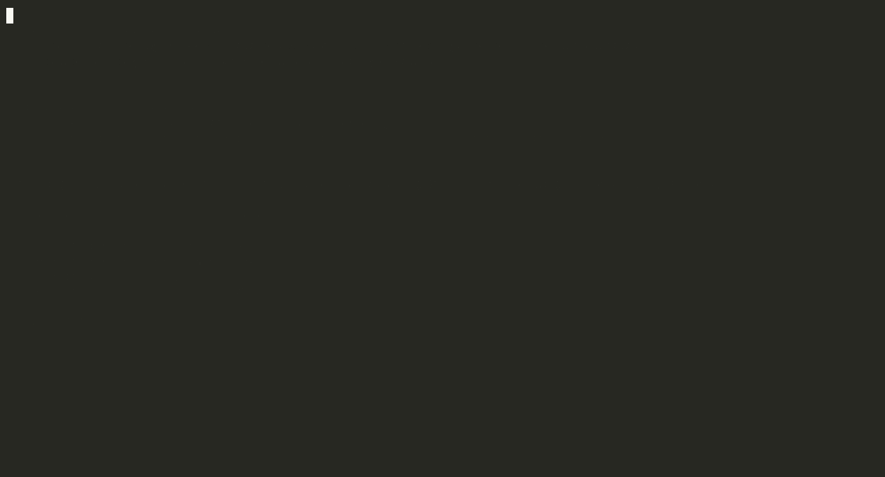

# Education-to-Career Pathways Knowledge Graph



**1,098 nodes. 1,417 edges. One school district's published course catalogue, as a graph
you can walk — plus nine measured public sources for the college and career side.**

> Part of the **Samyama** ecosystem — loaded into and queried via the graph engine at [samyama-ai/samyama-graph](https://github.com/samyama-ai/samyama-graph).
> This repo holds the loader and source-data specifics for the KG.

<a href="LICENSE"></a>

> **One district is loaded and measured — 1,098 nodes, 1,417 edges, in 8.2 seconds.**
> The national spine (CIP-SOC, IPEDS, BLS, College Scorecard) is measured but not yet
> loaded. Counts, licences and known limitations are in [`docs/`](docs/).

---

A student picks courses four times in high school. The decisions are close to irreversible,
and they are made with almost no information about what each one leads to.

> *"If a student doesn't pass Algebra 1, what closes off?"*

Nobody publishes that answer. The district publishes the courses. It publishes the
prerequisites, as real links between its own pages. It does not publish where any of them
lead — because that is not a page, it is the relationships between pages.

As a graph it is one traversal.

```cypher
// Everything a student can no longer reach, at any depth
MATCH (blocked:Course)-[:REQUIRES*1..8]->(:Course {name: 'Algebra 1'})
MATCH (blocked)-[:IN_SUBJECT]->(s:Subject)
RETURN s.name AS subject, count(DISTINCT blocked) AS closed_off
ORDER BY closed_off DESC LIMIT 5
```

| subject | closed_off |
|---|---:|
| Science - IB Programme | 4 |
| Math - Electives | 3 |
| Math - Computer Electives | 3 |
| Math - Standard | 3 |
| Science - Dual Enrollment | 3 |

**28 courses across 14 subjects** — and not just more maths: chemistry, biology, IB and
dual-enrolment science. The depth is not known before the question is asked, which is why a
relational database does this badly and the graph does it in 10 ms.

---

## Demo

Twenty-one questions, climbing from one a spreadsheet answers perfectly to ones it cannot
answer at all. Every figure is read from the engine as it runs; nothing is stored.

```bash
docker run -d --rm -p 8200:8080 public.ecr.aws/f9f6l5u4/samyama-graph:1.1.0
curl -X POST http://localhost:8200/api/tenants -H 'Content-Type: application/json' \
     -d '{"id":"edtech","name":"EdTech KG"}'

python -m etl.load_pwcs --url http://localhost:8200 --graph edtech
python -m demo.demo     --only 0,5,8,11,13,15,16,17,19  # the nine for a short meeting
python -m demo.demo --list                             # all 21, no engine needed
```

| Tier | | Honest verdict on a relational database |
|---|---|---|
| 1 | lookup | does this perfectly — and the demo says so out loud |
| 2 | one hop | a join. Fine |
| 3 | the shape of the catalogue | awkward, still possible |
| 4 | **unknown depth** | recursive, and you must know the depth to write it |
| 5 | **two structures at once** | unmaintainable |

Conceding the first three tiers is what makes the last two land. Three answers from the top
that exist nowhere else:

- **Fail Algebra 1 and 28 courses close off**, across 14 subjects
- **Every course ranked by what fails to open without it** — an intervention list
- **The Information Technology pathway requires five courses its own page never lists**

---

## What is loaded

Prince William County Schools, `catalog.pwcs.edu`. Public pages only — no login, no student
data, nothing that is not already on the internet.

| Label | Count | |
|---|---:|---|
| `Course` | 791 | one published course page |
| `Requirement` | 138 | a stated condition that is **not** a course reference |
| `Subject` | 127 | the catalogue's own grouping |
| `Pathway` | 42 | 16 career pathways, 25 specialty programs, and one the catalogue places under neither — `kind` is omitted rather than guessed (#156) |

| Edge | Count | |
|---|---:|---|
| `IN_SUBJECT` | 723 | course → its subject |
| `REQUIRES` | 240 | **the prerequisite edge — 240 of 240 resolve** |
| `INCLUDES` | 316 | pathway → course, carrying the credit value published |
| `HAS_REQUIREMENT` | 138 | course → a condition naming no course |

**The prerequisites resolve because the district publishes them as links, not prose.** That
is the finding the whole build rests on — and it is not general. See the limits below.

---

## Measured sources

Every figure below is printed by a probe in `etl/`. None is hand-typed.

| Source | Probe | Measured |
|---|---|---|
| PWCS course catalogue | `probe_pwcs` | 960 catalogue pages — 791 courses, 240 resolvable prerequisite edges, 0 dangling |
| CIP-SOC crosswalk | `probe_cipsoc` | **5,903** programme→occupation mappings over 2,143 programmes — 194 of the 6,097 rows say there is no mapping |
| IPEDS / CCD | `probe_education` | 9,026,310 completion **rows** describing 10,620,172 awards (#43), 6,256 institutions, 102,268 schools, 19,714 districts |
| Credential Registry | `probe_registry` | 47,861 courses, 133,346 credentials, **98** pathways |
| CTDL vocabulary | `probe_ctdl` | the prerequisite property exists — and is used **0 times in 600 courses** |
| schema.org | `probe_schemaorg` | 14 of the 14 terms this graph needs are present |
| State course directories | `probe_state_courses` | statewide directories publish **no** prerequisites |
| College Scorecard | `probe_scorecard` | median earnings for **25.5%** of programme rows — 58,112 of 169,868 |
| Registered Apprenticeship | `probe_apprenticeship` | **419** occupations reachable by apprenticeship, **0** of them missing from the crosswalk this repo loads — the two published CIP-SOC crosswalks disagree by **63** |

---

## Schema

`schema/edtech_kg.cypher` and `schema/edtech_kg_tier2.cypher` are the executable ontology —
tier 1 is what is populated from a measured source, tier 2 what is declared but not yet
loaded. `tests/test_schema_cypher.py` runs every statement in **both** against a live engine,
and executes the tier-4 traversals rather than asserting them. Anything applying "the schema"
reads both; a reader that takes only tier 1 still loads cleanly, eight keys short.

**Nothing is minted.** Every shape has a published name, and the verdict for each — adopt,
align, or mint — is in [`docs/ontology-reuse.md`](docs/ontology-reuse.md), each linked to
its external definition so a reader can check the mapping rather than trust it.

- **schema.org**, adopted verbatim — `Course`, `Occupation`, `Credential`, `hasCourse`,
  `educationalCredentialAwarded`, `occupationalCategory`
- **CTDL** — `Occupation`, and `Programme → Occupation`
- **Aligned**, ours being narrower — `Programme` (CIP-coded), `Institution` (IPEDS-keyed),
  `Institution → Programme`
- **Undecided, and marked so** — schools, districts, standards and competencies, pending
  Ed-Fi (#31), CASE (#32) and CEDS (#29)

The prerequisite edge was going to be `ceterms:prerequisite`. We measured whether anyone
uses it: **zero times in 600 published courses**, while all 150 courses that state a
prerequisite state it as free text. So the graph adopts `schema:coursePrerequisites`, which
accepts a course reference *or* text. That reversal came from measurement rather than
preference, and the working is on the page.

---

## What this does not claim

- **One district.** Prince William County publishes on Clean Catalog, a Drupal product, and
  its prerequisites came out as typed links. Whether a second district resolves as cleanly
  is **#19** — open, and untested.
- **395 of 791 courses stand outside every chain and every pathway.** Half. Most
  courses genuinely have no ladder, and that number is on screen in the demo rather than
  behind it.
- **138 conditions are not course references** — an audition, a teacher recommendation.
  Held as `Requirement` nodes, never turned into edges the district did not publish.
- **16 of 390 pathway rows** point at an internal Drupal node id with no published alias
  and cannot be resolved by URL. Reported, never dropped.
- **The national spine is measured, not loaded.** No programme, occupation, institution or
  earnings data is in the graph yet.
- **Earnings cover a quarter of programmes.** College Scorecard publishes a median
  figure for 25.5% of programme rows; the rest are suppressed or not applicable, and
  the figure is for graduates who took federal aid, not all graduates. That caveat has
  to travel with any answer built on it.
- **Pay and outlook are not here at all.** BLS covers them for 96% of the occupations a
  programme can reach, but that probe is still in review (#37) and this README
  describes only what is merged, not what is open in a branch.
- **No student data of any kind** — by design, not by omission.

---

## Structure

```
.github/      ci.yml — the suite on every push and PR, with a real engine
etl/          probes (one per source) + load_pwcs.py
schema/       edtech_kg.cypher + edtech_kg_tier2.cypher — the executable ontology
demo/         demo.py — 21 questions, tiered
docs/         scope, questions, schema, ontology-reuse, sources/
benchmarks/   the traversals behind docs/questions.md — empty, see #22
mcp_server/   not implemented; mcp_server/README.md says what it should expose
tests/        pytest, one file per subject
```

The same seven directories as every sibling `*-kg` repo, so anyone who has seen one can
navigate this one. Two hold only a README today, and each says so — an empty directory
reads as "nothing to do here", which is the opposite of what it means.

`CONTRIBUTING.md` carries the standard a PR here works to.

## Quick start

```bash
python -m venv .venv && source .venv/bin/activate
pip install -e .

python -m etl.probe_pwcs         # measure a source — every figure in the docs comes from these
python -m etl.load_pwcs          # build + load the graph
python -m demo.demo              # walk it
pytest                           # the whole suite, no engine needed
```

CI runs the same suite against a real engine. `SAMYAMA_REQUIRE_ENGINE=1` makes an
unreachable engine fail the build rather than skip, and `SAMYAMA_CI=1` makes an
unexpected skip fail it too — a skip is indistinguishable from a pass in every
summary line.

Locally, engine-backed tests skip unless an engine is reachable. Point them at a **fresh** instance — they
write and delete:

```bash
docker run --rm -p 8201:8080 public.ecr.aws/f9f6l5u4/samyama-graph:1.1.0
SAMYAMA_TEST_URL=http://localhost:8201 SAMYAMA_REQUIRE_ENGINE=1 pytest
```

`SAMYAMA_REQUIRE_ENGINE=1` turns an unreachable engine into a failure rather than a skip,
because "verified against the engine" should never reach a README on the strength of a run
nobody made.

## Which engine produced these figures

Every count on this page and in `docs/` was measured against one build.

| | |
|---|---|
| Image | `public.ecr.aws/f9f6l5u4/samyama-graph:1.1.0` |
| Digest | `sha256:458895059c24b8b809f7e9fa42b62a16734254b0cc4dc7562a34cca12506f517` |
| Version the engine reports | **1.7.0** |

**The tag and the version are different numbers, and that is not a mistake.** The image is
tagged `1.1.0`; the binary inside reports `1.7.0` from `/api/status`. Where this repo
says "1.1.0" it means the tag — the thing you can actually pull. Both are recorded because
a figure attributed to "1.1.0" is otherwise ambiguous between the two, and the person
trying to reproduce it has no way to tell which was meant.

The digest is here for the gap a tag cannot close: a tag can be repushed under the same
name with different bytes, so a reader pulling `1.1.0` next month cannot otherwise tell
whether they got what was measured. Pull by digest to be certain:

```bash
docker run --rm -p 8201:8080 public.ecr.aws/f9f6l5u4/samyama-graph@sha256:458895059c24b8b809f7e9fa42b62a16734254b0cc4dc7562a34cca12506f517
```

**What a version bump means.** Every published figure becomes unverified until it is
re-measured — not wrong, unverified, which is worse because nothing looks different. The
figures are not the only thing at stake: this repo works around engine behaviour in about
sixty places (a constraint that declares a key without enforcing it, an edge `MERGE` that
ignores its property map, `ORDER BY` on a non-aggregate alias being ignored), and each of
those workarounds is correct only for the build it was measured against.

So, on a bump: run the suite with `SAMYAMA_REQUIRE_ENGINE=1` first.
`tests/test_engine_version.py` fails the moment the engine stops reporting the recorded
version, and the engine-behaviour tests fail if a limitation has been fixed — which is the
point, because a fixed limitation means a workaround to delete rather than keep. Then
reload, re-measure, and update the figures in the same commit as the constant in
`etl/engine.py`.

